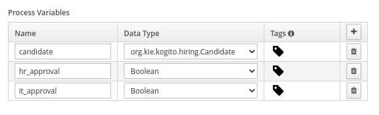

# Kogito Consoles Quickstarts

## Description

This module contains a set of examples that will help you to get started with both _Kogito Management Console_ & _Kogito Task Console_.

The quickstarts are based on a simple Hiring Process Kogito project. Starting by a basic example, each new one will be introducing new variants (such as authentication, jobs management...) that will give you a wider view of the Kogito Consoles.

Each example will provide the instructions and scripts to easily setup all the required infrastructure and run the example.

## The Hiring example

All the quickstarts are based on a simple Hiring process that drives a *Candidate* through different interviews until it gets hired.

### Process data

The process handles three _Process Variables_:

* *candidate*: represents the candidate person that wants to get the job. It is an instance of *org.kie.kogito.hiring.Candidate*.
* *hr_approval*: a boolean that ensures that HR department approves the hiring.
* *it_approval*: a boolean that ensures that IT department approves the hiring.

### The Business Logic

The example process consists in two human tasks that will drive the candidate trough two interview with *HR* and *IT* departments.

    

Once it starts, the process will move into the *HR Interview task*, this task represents an interview with the someone from the company HR department.

The task will get the *candidate* as an input assignment and as an output it will generate an *approval* boolean that represents assesment of hiring or not hiring the *candidate*. It will be stored on the *hr_approval* process variable

    
     <i>HR Interview assignments</i>

After completing the *HR Interview* the candidate moves to the *IT Interview* task with the company IT department. Ashe task will get the *candidate* as an input assignment and as an output it will generate an *approval* boolean that represents assesment of hiring or not hiring the *candidate*.

    
     <i>IT Interview assignments</i>

## Quickstarts Summary

[01.- Kogito Consoles Basic Example](01-kogito-consoles-basic-example)
